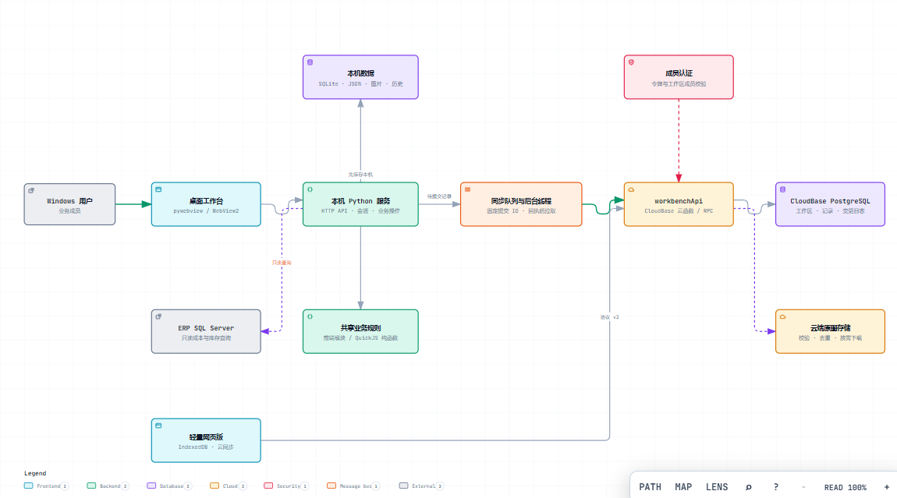

# DIY 配置工作台

面向 DIY 整机业务的本地优先工作台，用于维护多店商品配置、核算成本与利润、读取 ERP 库存、制作配置图，并通过 CloudBase 与团队成员同步。当前源码版本为 **Python 桌面版 1.0.5**，支持 Windows 10/11 x64。

## 快速入口

| 我想做什么 | 入口 |
| --- | --- |
| 下载可运行程序 | [最新 GitHub Release](https://github.com/yamakaze1234/diy-tools/releases/latest) |
| 看完整功能与操作步骤 | [功能说明书（HTML）](docs/DIY配置工作台-产品说明书.html) |
| 第一次使用或查操作流程 | [使用教程](docs/使用手册.md) |
| 了解系统组成和数据流向 | [系统架构说明](docs/架构说明.md) · [交互架构图](docs/diagrams/architecture.html) |
| 自行部署或参与开发 | [部署与开发](docs/部署与开发.md) |
| 备份、升级、迁移与排错 | [维护与排错](docs/维护与排错.md) |

> GitHub 源码 ZIP 不是桌面安装包。日常使用请下载 Release 中的 Windows ZIP，完整解压后运行 EXE。公开包不包含现有团队数据、生产云配置或成员账号。

## 主要功能

| 模块 | 能力 |
| --- | --- |
| 商品与配置 | 按店铺、分类和商品链接管理多套配置；支持空白新建、WPS 导入、模板复用、同店复制与跨店复制 |
| 配件与价格 | 维护实际配件、展示配件、数量、SPU/SKU、到手价、优惠券、分期、服务承诺和组合加购 |
| ERP 与库存 | 按商品 ID 只读查询 SQL Server 成本与可销数；预览差异后应用；检查链接库存并生成替换方案 |
| 批量维护 | 批量换配件、更新内容、同步输出源差异、统一配色和排版，并导出维护表与库存监控数据 |
| 图片制作 | 机箱图库、多图片图层、文字与模块自由布局、长图/方图、PNG 与 ZIP 批量导出 |
| 商品标准 | ERP 商品刷新查询，导入或导出统一商品标准 JSON，维护店铺、SPU、SKU、ERP 商品及配件关联 |
| 团队协作 | 本机先保存；手动或定时同步；查看本机修改、云端提交和三方差异；显式处理冲突 |
| 轻量网页版 | 浏览器中维护配置与共享数据，使用 IndexedDB 保存本地状态；ERP 成本和库存保持只读边界与未知状态 |

## 三分钟上手

1. 从 [Releases](https://github.com/yamakaze1234/diy-tools/releases/latest) 下载 Windows ZIP，完整解压，保持 EXE 与 `_internal` 文件夹同级。
2. 双击 EXE，使用管理员开通的成员账号登录。首次使用按提示接收团队工作区，或由初始化成员发布本机基线。
3. 选择店铺、商品链接和配置；维护实际配件、数量、售价、人工核算价、升级项与服务说明。
4. 需要最新成本和库存时打开“ERP同步”，先检查预览，再确认应用。库存未知不会被当作零库存。
5. 调整配置图并保存，确认预览后下载 PNG，或勾选多套配置批量导出 ZIP。
6. 需要让同事看到修改时，打开“多人同步”并执行“立即同步”，处理提示的冲突或待确认状态。

更多操作细节、按钮位置和完成标准见[使用教程](docs/使用手册.md)。面向业务同事的可搜索、可打印版本见[功能说明书](docs/DIY配置工作台-产品说明书.html)；下载该 HTML 后可直接用浏览器打开。

## 系统架构



[打开交互架构图](docs/diagrams/architecture.html) · [查看架构 JSON](docs/diagrams/architecture.json) · [阅读架构说明](docs/架构说明.md)

桌面端通过 WebView2 展示共用前端，由本机 Python 服务处理保存、历史、ERP 查询和同步队列。普通编辑先写入本机 SQLite/JSON；同步线程收到云端提交回执后再拉取变更。ERP 只读查询、SQL 凭据、ERP 成本和库存保留在本机，不作为共享业务字段上传。轻量网页版复用云协议，但不伪造本机 ERP 数据。

## 文档

| 文档 | 适合谁 | 内容 |
| --- | --- | --- |
| [功能说明书](docs/DIY配置工作台-产品说明书.html) | 日常业务成员 | 可搜索、可展开、可打印的完整功能步骤 |
| [使用教程](docs/使用手册.md) | 第一次使用和日常查阅 | 安装、登录、配置、ERP、出图、同步、恢复 |
| [系统架构](docs/架构说明.md) | 维护者和开发者 | 组件职责、数据位置、同步时序与边界 |
| [部署与开发](docs/部署与开发.md) | 部署者和开发者 | CloudBase、成员配置、uv 环境、测试和打包 |
| [维护与排错](docs/维护与排错.md) | 管理员和维护者 | 备份、升级、换电脑、恢复与常见问题 |
| [数据库维护与版本回退](docs/数据库维护与版本回退说明书.md) | 数据库维护者 | 数据库变更、保留策略与版本回退 |

## 源码运行

准备 PowerShell 7、Node.js 24、uv、Python 3.13.6 和 Microsoft Edge WebView2。在仓库根目录执行：

```powershell
npm ci --prefix prototype
uv sync --project python-desktop --locked
if (!(Test-Path prototype/.env.local)) { Copy-Item prototype/.env.example prototype/.env.local }
# 编辑 prototype/.env.local，填写自己的 CloudBase 客户端配置。
npm run build:sync --prefix prototype
node python-desktop/build-web.mjs
Copy-Item prototype/.env.local python-desktop/web/.env.local
uv run --project python-desktop --locked python -X utf8 python-desktop/main.py
```

公开示例配置不能连接现有团队环境。自行部署需要准备 CloudBase 认证、PostgreSQL、云函数和存储，按[部署与开发](docs/部署与开发.md)完成数据库迁移、成员开通和客户端配置。

## 测试与打包

```powershell
npm test --prefix prototype
npm test --prefix web-lite
uv run --project python-desktop --locked python -X utf8 -m unittest discover -s python-desktop/tests -v
uv run --project python-desktop --locked python -X utf8 python-desktop/build.py
```

Node 与 Python 默认测试使用合成数据。浏览器验收、在线云同步和正式打包需要相应运行环境，不属于默认测试。

## 目录

| 路径 | 内容 |
| --- | --- |
| `python-desktop/` | Python + pywebview 桌面端、构建脚本和测试 |
| `prototype/` | 共用前端、业务规则、Node 开发服务和前端测试 |
| `web-lite/` | 轻量网页版源码、构建脚本和测试 |
| `shared/` | 桌面端与网页端共用的同步协议 |
| `cloud/functions/workbenchApi/` | CloudBase 云函数 |
| `cloudbase/migrations/` | PostgreSQL 迁移 SQL |
| `docs/` | 使用、架构、部署、维护和产品文档 |

## 数据边界

实际配置、成本、库存、成员数据、登录缓存、SQL 凭据、生产云配置、数据库、发布包和验收输出均不进入 Git。仓库只提供空白的 `prototype/seed.example.json`、`catalog.example.json` 和云配置示例。

源码运行的数据目录为 `python-desktop/data`；打包后为 EXE 同级的 `data`。升级或移动程序时应保留完整 data 目录，具体步骤见[维护与排错](docs/维护与排错.md)。

本仓库尚未指定开源许可证；第三方依赖与品牌素材保留各自权利。
