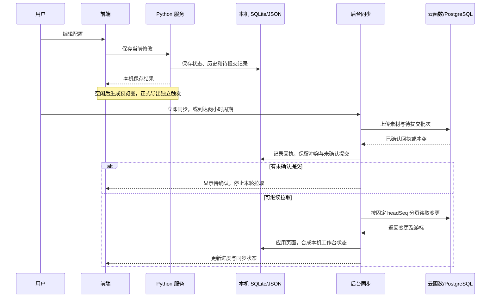

# 系统架构

适用版本：Python 桌面版 0.3.4。[返回首页](../README.md)

## 1. 组件关系

另提供[可交互架构图](diagrams/architecture.html)：下载 HTML 后用浏览器打开，支持缩放、搜索、主题切换及导出；GitHub 文件页本身显示源码。图的[JSON 源文件](diagrams/architecture.json)一并保存。

Python 桌面端是当前入口。`prototype/` 同时保存界面与 Node/Electron 原型，Python 构建复用其前端和纯业务规则。**Python 成品运行时不启动 Node 或 Electron**；Node/esbuild 用于构建，QuickJS 在 Python 内部执行有限的纯函数。

## 2. 源码职责

| 模块 | 职责 |
| --- | --- |
| [main.py](../python-desktop/main.py) | 单实例检测、WebView2 窗口、端口与关闭前保存 |
| [server.py](../python-desktop/server.py) | 本机 HTTP API、来源与会话检查、静态资源 |
| [service.py](../python-desktop/service.py) | 编辑保存、历史版本、SQL 预览应用、业务状态锁 |
| [store.py](../python-desktop/store.py) | SQLite 记录、队列、回执、游标和修改记录 |
| [cloud.py](../python-desktop/cloud.py) | 身份校验、后台同步、图片传输和差异读取 |
| [domain.py](../python-desktop/domain.py) | 独立线程持有 QuickJS 上下文，复用 JS 业务纯函数 |
| [sql_service.py](../python-desktop/sql_service.py) | ERP 查询、商品 ID 规范化与库存字段检查 |
| [credentials.py](../python-desktop/credentials.py) | Windows DPAPI 和成员范围的 SQL 凭据保存 |
| [storage_paths.py](../python-desktop/storage_paths.py) | 便携数据路径、旧数据迁入、SQLite 一致性复制 |
| [prototype/](../prototype/) | 前端模块、海报渲染、导入导出、Node/Electron 兼容入口 |
| [shared/sync/](../shared/sync/) | 同步协议与迁移预览 |
| [workbenchApi](../cloud/functions/workbenchApi/index.js) | 将带成员令牌的请求转交 PostgreSQL RPC |
| [migrations/](../cloudbase/migrations/) | 成员、记录、回执、变更日志与存储权限 |

## 3. 编辑和同步生命周期

一次本机保存不等于一次云提交。同步队列保留提交 ID；服务端以回执表识别重复请求。同步上传确认后再拉取，分页使用固定云端序号边界。冲突需要明确选择，不按客户端时间直接覆盖。

## 4. 数据位置与共享边界

| 数据 | 本机位置/职责 | 云端 |
| --- | --- | --- |
| 当前配置 | `state.json` 与同步工作台状态 | 共享字段投影至 `wa_records` |
| 待提交、回执、游标、修改记录 | `workspace.sqlite` | 回执与变更记录分别对应 `wa_mutations`、`wa_changes` |
| 历史版本 | `versions.sqlite` | 本机版本列表不等于云提交日志 |
| 图片 | `assets/`、`images/`，按需读取与生成 | 共享原始素材存入私有图片桶 |
| ERP 成本、可销数 | 各电脑独立读取与保存 | 不作为当前业务共享字段上传 |
| SQL 连接及密码 | `sql-credentials/` 加密保存 | 不上传 |
| 浏览器登录缓存与运行信息 | `runtime/` | 用于本机登录会话 |
| 导出 PNG/ZIP | 用户选定路径 | 不自动上传导出结果 |

`wb_*` 和协议 1 是早期同步验证结构，`wa_*` 和协议 2 是当前应用结构；不要把验证表当成当前业务表。SQL 枚举中保留历史类型不意味着现行客户端同步所有这些字段。

## 5. 线程与边界

- HTTP 请求由 Python 本机服务处理，业务状态提交通过服务锁协调；SQL 网络等待与云网络等待不长期持有该锁。
- 云同步单独调度，一轮内部等待上传结果，再读取云端变更。
- QuickJS 上下文由独立单线程执行器持有，不能访问文件、网络或系统命令。
- 本机 HTTP 仅监听回环地址并检查来源；这不是可以直接暴露到局域网的多人服务器。
- CloudBase 认证用户与工作区成员是两层身份。PostgreSQL RPC 从有效令牌取得身份并验证成员，客户端不能自行指定可信成员 ID。

## 6. 图示核验范围

架构关系依据本仓库源码整理。交互图通过 Archify 的 9 项产物检查，布局诊断为 0 错误、0 警告；未进行人工浏览器视觉验收。SQL、云端和桌面运行的部署结果应以部署者实际验收为准。
